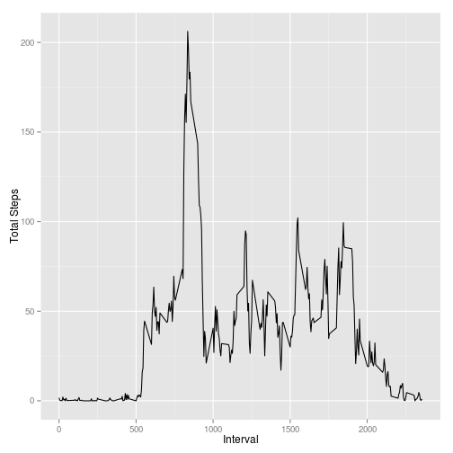

## Loading and preprocessing the data

Unzip the data file and load into data variable.


```r
	unzip("activity.zip")
	data <- read.csv("activity.csv")
	library(dplyr)
	library(ggplot2)
```

Note: functional library **dplyr** is used in all further steps.

## What is mean total number of steps taken per day?

Data preparation steps;

1. Group data by date variable.

2. Add new variable **total_steps** to the data which contains summary of all steps.

Represent the data by using ggplot in histogram scheme.


```r
	total_steps_by_date <- data %>% group_by(date) %>% summarise(total_steps = sum(steps, na.rm = TRUE))
	total_steps_by_date %>% ggplot(aes(x=total_steps)) + geom_histogram()
```

```
## stat_bin: binwidth defaulted to range/30. Use 'binwidth = x' to adjust this.
```

 

```r
	mean_steps <- mean(total_steps_by_date$total_steps, na.rm = TRUE)
	median_steps <- median(total_steps_by_date$total_steps, na.rm = TRUE)
```

Mean of steps: ``9354.2295082``, median of steps ``10395``.


## What is the average daily activity pattern?

Data preparation steps:

1. Grouped by interval variable.

2. New variable **average_steps** is introduced which holds the mean value of all steps.


```r
	average_steps_by_interval <- data %>% group_by(interval) %>% summarise(average_steps = mean(steps, na.rm = TRUE))
```

Finally, data is represented in line scheme.


```r
	average_steps_by_interval %>% ggplot(aes(interval, average_steps)) + geom_line() + xlab("Interval") + ylab("Total Steps")
```

 

```r
	top <- total_steps_by_interval %>% top_n(n=1)
```

```
## Selecting by total_steps
```

The maximum steps taken is ``10927``.


## Imputing missing values

First, the missing steps variables are filled by **average_steps** variable of the corresponding row.

Then the data (where missing steps are filled) is represented in histogram scheme.


```r
	na_steps <- data %>% filter(is.na(steps)) %>% count
	filled <- data %>% mutate(steps = ifelse(is.na(steps), average_steps_by_interval[interval / 5 + 1]$average_steps,steps))
	filled_steps_by_date <- filled %>% group_by(date) %>% summarise(steps = sum(steps))
	filled_steps_by_date %>% ggplot(aes(steps)) + geom_histogram()
```

```
## stat_bin: binwidth defaulted to range/30. Use 'binwidth = x' to adjust this.
```

 

```r
	filled_steps_mean = mean(filled_steps_by_date$steps, na.rm = TRUE)
	filled_steps_median = median(filled_steps_by_date$steps, na.rm = TRUE)
	is_identical <- ifelse(filled_steps_mean == filled_steps_median, "identical", "not identical")
```

Found median (``1.0766189 &times; 10<sup>4</sup>``) and mean (``1.0766189 &times; 10<sup>4</sup>``) are ``identical``.


## Are there differences in activity patterns between weekdays and weekends?

New variable is introduced in data which indicates if the relevant event is happened in weekend or not.

```weekdays()``` helper function is used in order to determine when the even is occured.

 

```r
when_added <- data %>% mutate(when = ifelse(weekdays(as.Date(date)) %in% c("Saturday", "Sunday"), "weekend", "weekday"))
```

Plot the steps vs internal seperated by the time that is occured.


```r
when_added %>% group_by(when, interval) %>% summarise(steps = mean(steps, na.rm = TRUE)) %>% ggplot(aes(interval, steps)) + geom_line() + facet_grid(when~.) + xlab("Interval") + ylab("Steps")
```

 
